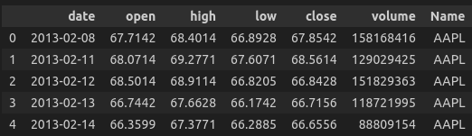
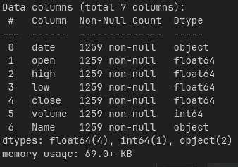
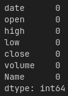
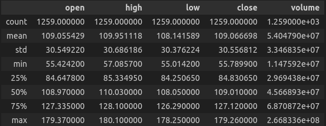
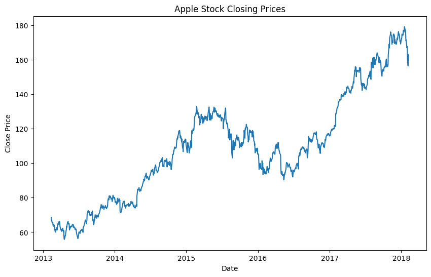

# Part I: Introduction

## 1. Backgroud
## 2. Problem Formulation
## 3. Aims

# Part II: Dataset

## 1. Dataset Description

***Description***

We are utilizing the [S&P 500 stock data](https://www.kaggle.com/datasets/camnugent/sandp500) dataset from Kaggle for our analysis. This dataset, last updated in 2018, is a comprehensive collection of historical stock prices for all companies currently listed on the S&P 500 index. The data spans a period of 5 years, providing a rich source of information for our study.

The dataset is well-structured and can be divided to analyze each individual company separately. This is facilitated by the `individual_stocks_5yr` folder, which contains data files for individual stocks. Each file is labelled by the respective company's stock ticker name, making it easy to locate and analyze data for a specific company.

Each file in the dataset contains the following columns:

- `Date`: This column records the date of the trading day in the format: yy-mm-dd. It allows us to track the stock's performance over time.
- `Open`: This column records the price of the stock at market open. This data is from the NYSE, so all prices are in USD. It provides a starting point for the day's trading.
- `High`: This column records the highest price the stock reached during the trading day. It gives us an idea of the stock's potential for the day.
- `Low`: This column records the lowest price the stock reached during the trading day. It provides insight into the stock's risk for the day.
- `close` : Closing price of the stock at the end of the trading day. Tt is a commonly used reference point for investors to assess the performance of a particular stock over time.
- `Volume`: This column records the number of shares traded during the trading day. It gives us an idea of the stock's liquidity and popularity.
- `Name`: This column records the ticker name of the stock. It allows us to identify the stock.

To provide a more focused context for this project, our team has chosen to analyze a specific company - Apple, one of the world's largest technology companies. Its stock is listed on the index as AAPL. The dataset we're using for this analysis is named `AAPL_data.csv`. Following is an overview visualization of the dataset:

A noteworthy characteristic of this dataset is the data column. Notably, the date `08-02-2013` falls on a Friday, and the subsequent date in the dataset, `11-02-2013`, is a Monday. This suggests that the data is recorded only on **weekdays**.

***Key Features***

Some statistic about this dataset: 

So there is no null value in this dataset

## 2. Preprocessing

### Stationary check

In oder to use AR, MA, ARMA models, we first had to make sure that out time seri is stationary (theory about stationary more detail in Part 3 Theory). 

First let have a look at our time seri:

As seen from the graph

### Transfor To Stationary

### Decomposition of the Series

## 3. Result After Preprocessing

# Part 3: Models

## Theory

## Implement

### Hyperparameter

Using PACF, ACF

### Train

### Envaluation

